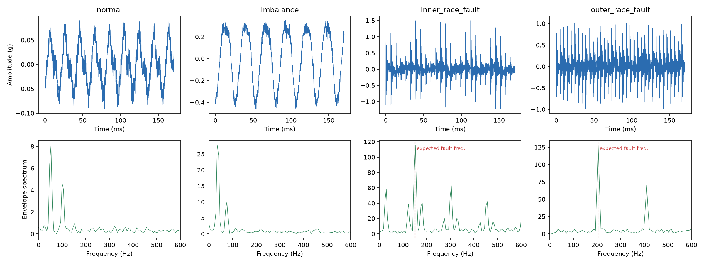
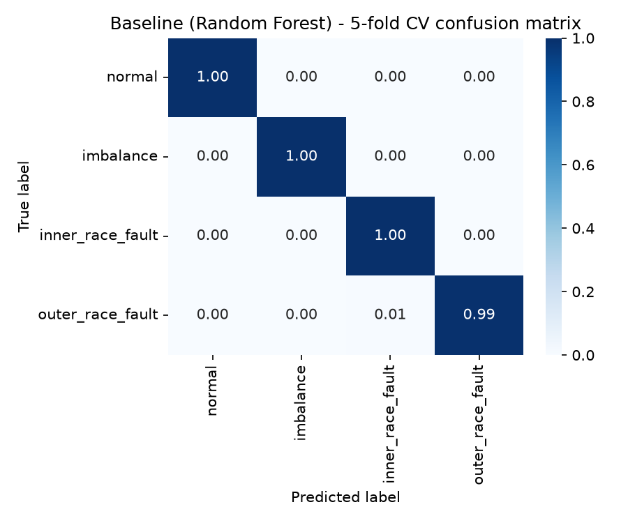
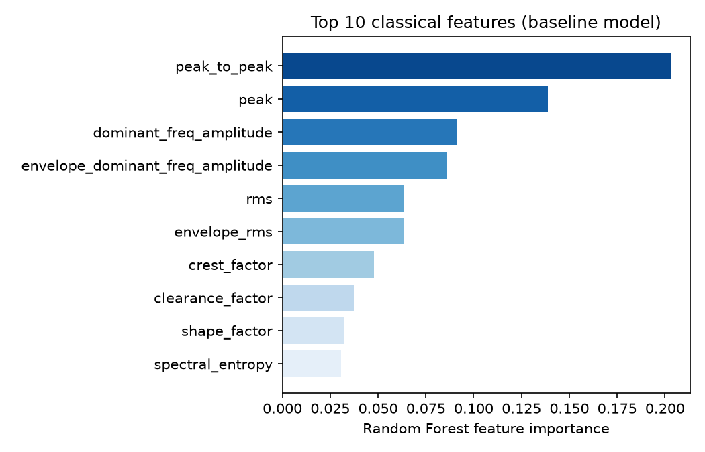

# TinyML Vibration Classifier

[](https://github.com/julians-eng/tinyml-vibration-classifier/actions/workflows/ci.yml)
[](LICENSE)
[](pyproject.toml)

A predictive-maintenance vibration classifier — **normal / imbalance / inner-race
bearing fault / outer-race bearing fault** — built to run on a microcontroller.
Two models are trained and compared on the same data: a classical
feature + Random Forest baseline, and a 1D CNN small enough to quantize to
int8 and embed on an **ESP32-S3** via TensorFlow Lite Micro
(`esp-tflite-micro`).

Leer esto en español: [README.es.md](README.es.md). Design decisions,
theory and a Spanish interview-prep guide: [docs/LEARNING.md](docs/LEARNING.md).

## Business problem

Unplanned rotating-machine downtime (motors, pumps, fans, gearboxes) is
expensive, and by the time a fault is audible or a bearing seizes, the
repair window has usually already closed. Vibration is the earliest
observable symptom: a **mass imbalance** shows up as an elevated 1x-shaft-speed
vibration long before it damages anything, and rolling-element bearing
defects ring a structural resonance at very specific, computable frequencies
(BPFI for an inner-race defect, BPFO for an outer race) well before the
bearing fails audibly. A cheap accelerometer plus a model small enough to
run *on the sensor node* — no cloud round-trip, no continuous raw-data
streaming — turns that physics into a real-time alert: normal / imbalance /
inner-race fault / outer-race fault, running entirely on a $5-class MCU.

## Pipeline

```
 data (synthetic, physically correct BPFI/BPFO -- or real CWRU via the swappable loader)
   |
   +--> classical features (RMS, kurtosis, crest factor, FFT, Hilbert envelope)
   |        -> StandardScaler + RandomForestClassifier, 5-fold stratified CV
   |
   +--> raw signal window
            -> 1D CNN (Keras) -> TFLite float32 -> TFLite int8 (representative-dataset quantization)
                 -> C byte array -> firmware/esp32s3 (ESP-IDF + esp-tflite-micro)
```

Everything below this line — every number, table and figure — comes from
actually running `python -m tinyml_vibration.pipeline` in the session that
built this repository (fixed seed, `SEED = 42`). The machine-readable output
of that run is committed at [`docs/results.json`](docs/results.json); rerun
the pipeline yourself and diff against it to verify reproducibility.

## Data: why synthetic, and how to switch to real data

This project targets the public
[Case Western Reserve University (CWRU) bearing data set](https://engineering.case.edu/bearingdatacenter)
as its real-world reference. That server was **not reachable** from the
network this project was built in (outbound access to
`engineering.case.edu` / `csegroups.case.edu` was blocked by policy) — so
rather than silently shipping without data, the default data source is a
**physics-informed synthetic generator**
(`tinyml_vibration.data.synthetic.SyntheticBearingDataset`):

* Fault frequencies (BPFI, BPFO) are computed from the *actual* SKF 6205-2RS
  JEM bearing geometry CWRU's drive-end rig uses (9 balls, 0.3126 in ball
  diameter, 1.537 in pitch diameter) via the standard rolling-element
  kinematics — see `tinyml_vibration.data.bearing_physics` — not made-up
  numbers.
* Each fault window is a train of impact-excited, exponentially decaying
  resonance pulses repeating at BPFI/BPFO (inner-race pulses are further
  amplitude-modulated at the shaft frequency, since that defect rotates
  through the fixed load zone; outer-race pulses are not, since that defect's
  position relative to the load zone is fixed) — the standard bearing-fault
  signal model (Randall & Antoni, *Rolling element bearing diagnostics — a
  tutorial*, MSSP 2011).
* Shaft speed (1200-3600 rpm) and SNR (3-20 dB) are randomized per window, so
  the model is trained across a speed/noise range rather than one operating
  point.

**Validation that this is physically correct, not just labeled noise:**
`tests/test_synthetic_data.py::test_fault_envelope_spectrum_peak_matches_bpfi_bpfo`
demodulates each fault window with a Hilbert-envelope spectrum and checks its
peak lands within 5% of the theoretical BPFI/BPFO frequency — it does, with
under 2% mean error at high SNR. See it visually in the figure below: the
dashed red line is the *theoretical* BPFI/BPFO frequency computed from
bearing geometry and shaft speed; the peak is measured from the generated
signal.



**Switching to real data** requires no pipeline changes: both the synthetic
generator and `tinyml_vibration.data.cwru_loader.CWRUDataset` implement the
same `VibrationDataset` interface (`.samples() -> list[VibrationSample]`).
`CWRUDataset` is implemented against CWRU's documented `.mat` format and
filename convention, but — for the same network-access reason — **has not
been run against the real files**; treat it as a documented starting point,
not a verified one. Point `SyntheticBearingDataset` calls in
`tinyml_vibration/pipeline.py` at `CWRUDataset(data_dir=...)` once the
`.mat` files are downloaded.

## Classical features + scikit-learn baseline

25 hand-engineered features per window (`tinyml_vibration.features.classical`):
time-domain (RMS, peak, crest factor, kurtosis, skewness, shape/impulse/clearance
factor), frequency-domain (spectral centroid, dominant frequency, 8-band
energy ratios, spectral entropy), and Hilbert-envelope features (envelope
RMS, envelope kurtosis, envelope spectrum peak) — the classic
condition-monitoring feature set.

**5-fold stratified cross-validation, Random Forest (200 trees):**

| Metric | Value |
|---|---|
| Accuracy | 99.83% ± 0.20% |
| F1 (macro) | 0.9983 ± 0.0020 |

Per-class F1: normal 1.000, imbalance 1.000, inner-race fault 0.9967,
outer-race fault 0.9967.



The two most important features by Random Forest importance are
`peak_to_peak` and `peak` (raw amplitude), followed by `dominant_freq_amplitude`
and `envelope_dominant_freq_amplitude` — consistent with the underlying
physics: imbalance is largely an amplitude effect, while bearing faults show
up as strong narrowband peaks (carrier and envelope) rather than just
amplitude.



## 1D CNN and int8 quantization

A small 1D CNN (`tinyml_vibration.models.cnn`) learns directly from the raw
2048-sample window: three strided `Conv1D -> BatchNorm -> ReLU` blocks
(8 -> 16 -> 32 channels) into global average pooling and a 16-unit dense
head — **3,124 parameters** total, chosen specifically to stay embeddable
after quantization (no `Flatten` into a large dense layer, which would
dominate the parameter count).

Trained 60 epochs (early stopping on validation loss) on a 60/20/20
stratified train/val/test split (720/240/240 windows) of the same 1,200-window
synthetic dataset. Converted to TFLite float32, then to a **fully int8
quantized** model (weights, activations and I/O all int8) using
`TFLiteConverter` with a 200-sample representative-dataset calibration pass.

**Accuracy and size, before vs. after quantization (test set, n=240):**

| Model | Test accuracy | Size |
|---|---|---|
| CNN, Keras float32 | 100.0% | — |
| CNN, TFLite float32 | 100.0% | 18.13 KB |
| CNN, TFLite **int8** | 100.0% | **12.36 KB** |

Quantization cost **0 accuracy points** on this test set and shrank the
model by **1.47x** (18.13 -> 12.36 KB). That ratio is well short of the
"classic" ~4x int8 speedup, and that's expected here, not a bug: at this
parameter count (3,124 params, ~12 KB of float32 weights) the TFLite
flatbuffer's fixed overhead (schema metadata, buffers, per-tensor
quantization parameters, operator codes) is a large fraction of the file, so
shrinking the weights 4x doesn't shrink the *file* 4x. Larger models see the
full ratio; this one trades some of that ratio for being small enough to fit
comfortably in an MCU's flash in the first place.


Estimated peak activation ("tensor arena") RAM: **16.0 KB** — a lower-bound
*estimate*, not a hardware measurement (see the docstring on
`estimate_peak_activation_bytes` for the exact method and its limits); the
firmware logs the real, measured arena usage at boot via
`MicroInterpreter::arena_used_bytes()` (see `firmware/esp32s3/README.md`).

## Robustness (noise and speed variation)

Trained only on rpm in [1200, 3600] and SNR in [3, 20] dB. Evaluated on a
disjoint, harder synthetic set (400 windows, different seed): rpm in
**[900, 4200]** (wider than training) and SNR in **[-3, 5] dB** (noisier than
training):

| Model | Accuracy on the stress set |
|---|---|
| Baseline (RF + classical features) | 91.75% |
| CNN (int8) | 88.50% |

Both models degrade gracefully rather than collapsing under out-of-range
speed and much heavier noise, though the classical-feature baseline
generalizes slightly better here than the raw-waveform CNN — plausible,
since several of its top features (crest factor, shape factor) are
scale-normalized by construction, while the CNN sees the raw (fixed-scale)
waveform.

## Model comparison

| Model | Accuracy | F1 (macro) | Size | RAM estimate |
|---|---|---|---|---|
| Baseline (RF + classical features, 5-fold CV) | 99.83% | 0.9983 | — (runs off-device / on a more capable MCU) | — |
| CNN, float32 (Keras) | 100.0% | 1.0000 | — | — |
| CNN, float32 (TFLite) | 100.0% | — | 18.13 KB | — |
| **CNN, int8 (TFLite, on-device)** | **100.0%** | **1.0000** | **12.36 KB** | **~16.0 KB (estimated)** |

## ESP32-S3 firmware

`firmware/esp32s3/` is a complete ESP-IDF project (`esp-tflite-micro`) that
embeds the exact int8 model bytes evaluated above
(`firmware/esp32s3/main/model/g_vibration_model.cc`, generated —
not hand-written — by `tinyml_vibration.models.export_c`) plus one
pre-quantized test window per class
(`main/model/g_test_vectors.cc`) so it self-tests the model integration at
boot without needing a sensor wired up yet:

```
I (312) vibration_inference: Model ready. Arena used: <measured> / 40960 bytes
I (320) vibration_inference: Self-test 0: expected=normal predicted=normal confidence=0.9x latency=<N>us
...
```

The model needs exactly six TFLite ops on-device — `CONV_2D`,
`EXPAND_DIMS`, `FULLY_CONNECTED`, `MEAN`, `RESHAPE`, `SOFTMAX`
(`docs/results.json` -> `firmware_export.required_tflite_ops`; BatchNorm is
fused into the preceding `Conv2D` by the converter, and no separate
quantize/dequantize op is needed since the model's I/O is already int8) —
and `main/inference.cc`'s `MicroMutableOpResolver` registers exactly those
six.

CI (`.github/workflows/ci.yml`, job `firmware`) builds this project with
`idf.py build` on every push, on GitHub-hosted runners (which have the
network access to `components.espressif.com` that this project's own
sandbox did not). It does **not** flash or run on real hardware — see
`firmware/esp32s3/README.md` "Future work" for exactly what that would take
(an accelerometer driver is the main missing piece, deliberately scoped
out — see below).

## Path to production

1. **Swap in real data.** Download the CWRU `.mat` files, point
   `CWRUDataset` at them, rerun the pipeline. If accuracy holds up, the
   synthetic-to-real gap is small; if it doesn't, that gap *is* the next
   thing to close (see Limitations).
2. **Wire up a real accelerometer** (e.g. ICM-42688-P over SPI for a wide
   enough bandwidth to resolve BPFI/BPFO at realistic shaft speeds) —
   scoped out of this repository, see `firmware/esp32s3/README.md`.
3. **Measure on real hardware**: exact latency, exact arena usage
   (`arena_used_bytes()`), power draw per inference. This repo estimates RAM
   and reports desktop-simulated accuracy; it does not claim on-device
   numbers it hasn't measured.
4. **Collect labeled field data** from the target machine population and
   fine-tune or retrain — synthetic and CWRU data both come from a
   laboratory rig, not the deployment fleet.
5. **Alerting/fleet layer**: aggregate per-device classifications (e.g. over
   MQTT) with hysteresis/debouncing before raising a maintenance ticket, so a
   single noisy window doesn't trigger a false alarm.
6. **OTA model updates** and a versioning scheme for deployed models —
   not implemented; the model is currently baked into the firmware image.

## Known limitations

* **Primary results are on synthetic data.** The synthetic generator is
  physically grounded (validated fault frequencies, standard fault signal
  model) but is still a simplified simulation — it does not capture every
  real-world nuisance (gear mesh interference, non-stationary load, sensor
  mounting resonances, multiple simultaneous faults). The CWRU real-data path
  is implemented but unverified (see Data section).
* **The "ball fault" CWRU class is mapped to this project's `imbalance`
  class** in `cwru_loader.py` as the closest available label — it is not
  physically the same fault mechanism (a ball defect rings BSF, not 1x shaft
  speed). If real CWRU data is used, revisit this mapping or add a fifth
  class.
* **RAM is an estimate**, not a hardware measurement — see the caveats on
  `estimate_peak_activation_bytes` and the note in `firmware/esp32s3/README.md`.
* **No accelerometer driver** is implemented; the firmware self-tests the
  model with embedded vectors but does not yet classify a live sensor
  stream.
* **No on-target firmware testing.** CI compiles the firmware; it is not
  flashed or run against real or emulated hardware.
* **100% test accuracy on the clean synthetic set** reflects a fully
  labeled, well-separated synthetic problem, not a claim that real-world
  deployment will see 100% accuracy — the robustness section and the
  limitations above are the more representative signal.
* **Single bearing geometry.** Fault frequencies are computed for one
  specific bearing (SKF 6205-2RS JEM); a different bearing needs its own
  `BearingGeometry` and, if its BPFI/BPFO ratios differ a lot, likely
  retraining.

## Reproduce

```bash
python3 -m venv .venv && source .venv/bin/activate
pip install -e ".[dev]"

pytest                      # 32 tests: bearing physics, features, synthetic data, models
ruff check . && ruff format --check .
mypy

python -m tinyml_vibration.pipeline   # regenerates docs/results.json and docs/img/*.png
```

## Project layout

```
src/tinyml_vibration/
  data/            synthetic generator, CWRU loader, common VibrationDataset interface
  features/        classical DSP feature extraction
  models/          sklearn baseline, Keras CNN, TFLite quantization, C-array export
  evaluation/       confusion matrices, F1, comparison tables, figures
  pipeline.py      end-to-end orchestration (this is what produced every number above)
firmware/esp32s3/  ESP-IDF + esp-tflite-micro project
tests/             pytest suite (bearing physics, features, synthetic data, model smoke tests)
docs/              results.json, img/, LEARNING.md
```

## License

[MIT](LICENSE)
